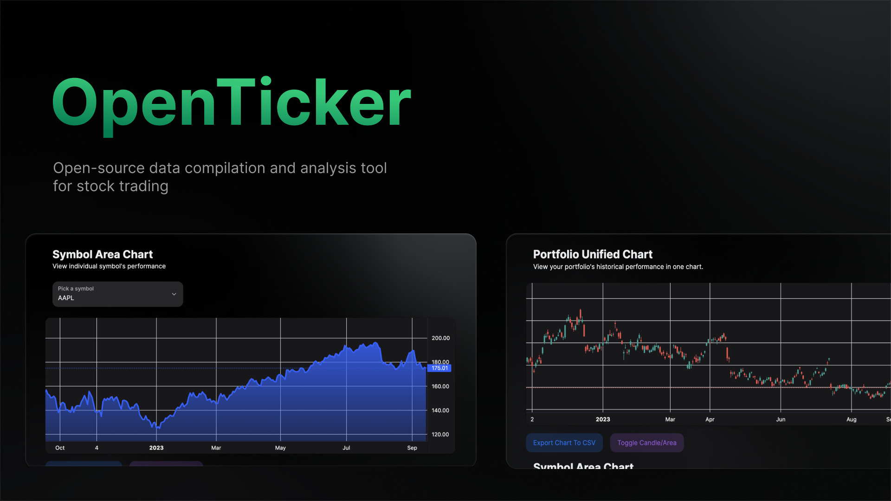
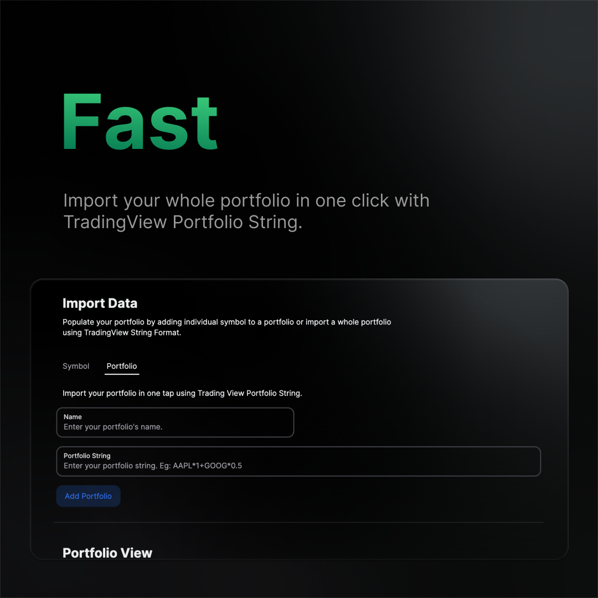
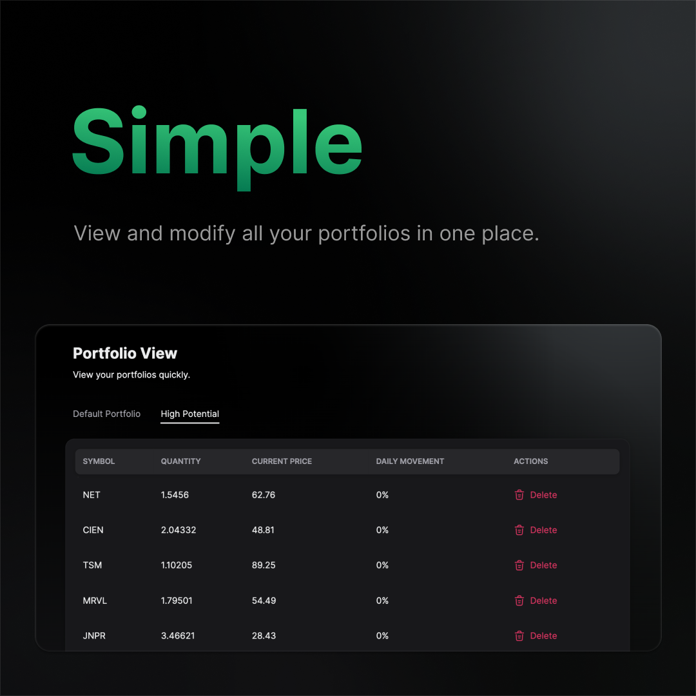
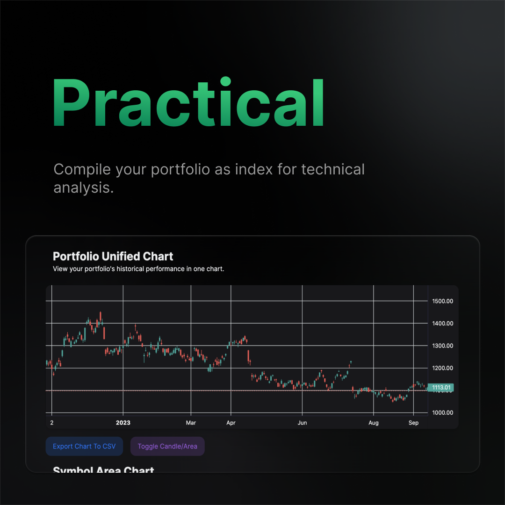
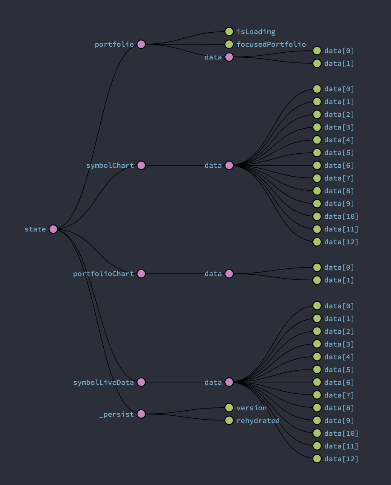

# Introduction



**OpenTicker** is an open-source data compilation and analysis tool for stock trading.

The project was initiated by **Binh Pham** when he saw that there was no free tool on the market that made portfolio analysis easy and quick. As a retail trader himself, he made a tool that he would used personally and recommend to others.

## Why?

> "When I built this, I simply needed a tool to compile all my symbols into a chart, so that my portfolio can be represented as a whole. But nothing do that for free or is very limited.
> TradingView supports only 10 symbols per chart. And if you want to do the same thing in excel, it is freaking nightmare.
> So I just build something that compiles the data for me, but it looks pretty cool, why not maintain it in a more stream-lined fashion?" - Binh Pham

> "The primative tool is for beginners in the stock market, for traders with medium-size portfolio who want to identify groups of correlating data in their investment early on.
> However, the project exhibits a well-defined structure and philosophy for expansion. It is built to be expandable and is expected to have more advanced features very soon" - Binh Pham

## Philosophy

The project’s development philosophy is based on three main staples:

- **Maintainable**: The project must be built with modularity and expandability in mind so developers can adapt their own solutions to the projects easily with interfaces and modules.
- **Transparent**: Every operation must be completely transparent and open. Users' data must be stored locally and process only within the application.
- **Logical**: The flow of execution in user experience and data process has to be concise and persistent throughout versions of the project.

## User Experience Flow

From an user standpoint, the logical flow of **OpenTicker** is the following:

1. **Import Data**: Users import data from external sources using Data Source Modules in **OpenTicker**.
2. **View Data**: Users view and modify their data from a dashboard using View Modules in **OpenTicker**.
3. **Compile Data**: Data is then compiled into user defined definitions using Compilation Modules in **OpenTicker**.
4. **Analyze data**: Compiled Data is then analyzed by the user or other modules in **OpenTicker**

This must be maintained and applied in every version of **OpenTicker**. The clear logical flow is what set **OpenTicker** apart from any other trading aid.

## Project's Vision

The philosophy and logical flow dictates everything the project represents. However, one question remains:

- **How can we use the project?**

Currently, the project's interface is statically built and [hosted on this repository](). This is only for demo purposes.

In the future, it will be converted into a micro-service based application with concise services per the logical flow, in which the interface will only be a part of. It will be like [**Home Assistant**](https://www.home-assistant.io/) where users self-host their instance with their own expansion and customization.

# Version 0.0.1 (Pre-Alpha)

## Disclaimer

This version was built in 12 hours as an very early build of the project. It is so that everyone can understand the project quickly and have a vision of what the project can be.

To accomodate the quick build, many things were done in a patchy way, hence multiple bugs and errors. For the complete smooth experience, please don't stress test the site, or else it will break.

This is only the starting point.

## Demo

A demo of this version can be access at [the repository's Github Page]().

## Features:

This version has the following features:

- Import data from Finnhub.
- View and create portfolio in one tap.
- View Live StockTrading data in your portfolio.
- Compile portfolio-as-index charts for technical analysis.
- Compile charts for symbols within your portfolio.
- Export CSV of compiled charts.




<br/>

## Known Problems

This version has the following known problems:

- **Redux State Persistent Error**: Redux Persist can be problematic with increasing amount of symbols and portfolio.
- **Rate Limited Finnhub API**: Finnhub only allows a certain amount of requests per minute. If you include a portfolio with a large amount of symbols, the program will have errors with data compilation as multiple symbols' data is empty.
- **WebSocket Error**: Finnhub has limited documentation for their WebSocket API, hence our interface for messages from their API sometime have errors.
- **No input validation**: OpenTicker has not included input validation for anything, except for Portfolio String as this can be quite easy to mess up.
- **No response validation**: OpenTicker has not included response validation for any Finnhub endpoint. If you receive a 429 or 404, data is still populated, but undefined.

## Developers Implementation

### Data Source Module

To ensure maintainability and expandability, **OpenTicker** uses **Adapter and API Gateway Design Pattern** for every data sources.

```TS
export abstract class StockAdapter {
  constructor() {}
  abstract changeToken(token: string): void;
  abstract initSocket(): void;

  abstract subscribeToSymbol(symbol: string): void;

  abstract unSubscribeToSymbol(symbol: string): void;

  abstract onSocketMessage(callback: (event: any) => void): void;

  abstract closeSocket(): void;

  abstract getChartForSymbol(symbol: string): Promise<SymbolChartEntry>;
}
```

If you want to add a new data source, you only need to write a module based on the Data Source Interface and prompt API Gateway to use your module.

Other modules inside **OpenTicker** can simply call an unified API Gateway for data.

### Technology Stack Implementation


**OpenTicker** uses NextJS as it provides a FullStack solution with multiple functionalities. Currently, it is built statically and runs locally on user machines to provide ease of presentation.

However, the vision for **OpenTicker** is a self-hosted service with user customization and expanded functionalities, like Home Assistant or Grafana.

### Storages

**OpenTicker** uses Redux for State Management. The data is currently fragmented into 4 categories:

- **SymbolCharts**: store symbols OHLC data
- **SymbolLiveData**: store symbols live streamed data from WebSocket.
- **PortfolioCharts**: store compiled data per charts
- **Portfolio**: store portfolio information



## Upcoming Features

The project's upcoming action points are the following:

- Fix known problems.
- Add more charts and indicators.
- **Move to server side rendering and local hosted approach as in the final vision**.

# License
